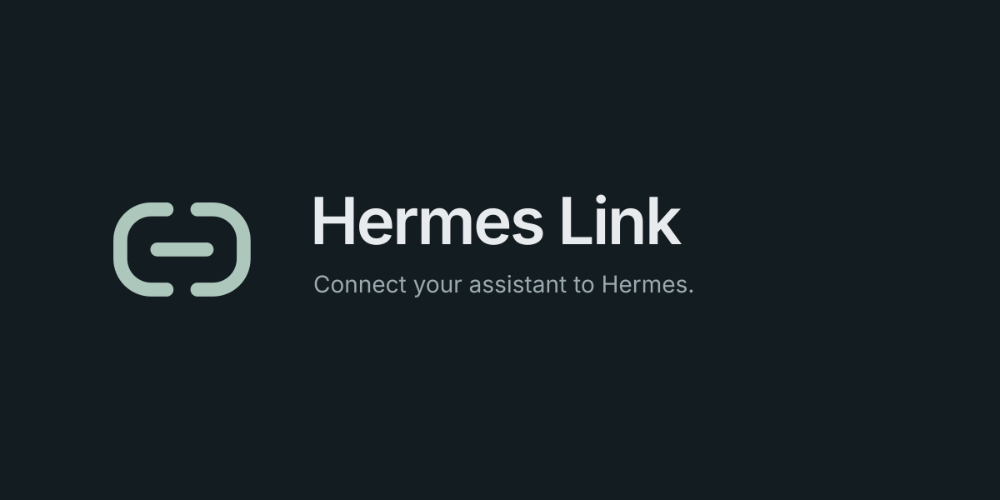

# Hermes Link



**0.8.0 · MIT**

[Быстрый старт](docs/quickstart.md) · [Инструменты и примеры](docs/compact-tools.md) · [Участие в разработке](CONTRIBUTING.md)

Работайте с Hermes из ChatGPT и других MCP-клиентов. Запускайте агентов, управляйте задачами и расписанием, меняйте настройки с историей версий и откатом.

Локальный Python-плагин Hermes. Импортирует `mcp_serve.create_mcp_server()` и добавляет управление через модули самого Hermes. HTTP MCP работает на `127.0.0.1`; по умолчанию доступны 10 компактных инструментов с 39 действиями, изменение данных и проверка локального Bearer-ключа. Desktop HTTP API и shell-команды для управления Hermes не используются.

При обновлении этого плагина используйте существующий туннель; новый tunnel ID не нужен.

Hermes Link также можно подключить к любому профилю самого Hermes: инструменты
доступны агенту в новом чате и при запуске этого профиля из Kanban. Локальное
подключение использует stdio и запускается самим Hermes; отдельный HTTP-сервер
и туннель для него не требуются. См. [подключение профилей](docs/profile-connection.md).

## Что доступно

| Инструмент | Действия (`action`) |
|---|---|
| `hermes_system` | `info`, `capabilities`, `memory_status`, `agents`, `agent` |
| `hermes_profiles` | `list`, `get`, `create`, `delete` |
| `hermes_tasks` | `run`, `status`, `result`, `continue`, `cancel` |
| `hermes_kanban` | `boards`, `get`, `task`, `assignees`, `create`, `update`, `archive` |
| `hermes_workers` | `list`, `get` |
| `hermes_sessions` | `list`, `get` |
| `hermes_cron` | `list`, `get`, `create`, `set_paused`, `delete` |
| `hermes_workspaces` | `list`, `get` |
| `hermes_settings` | `schema`, `get`, `update`, `apply`, `versions`, `restore` |
| `hermes_events` | `list` |

Каждый инструмент принимает `action` и объект `params` с параметрами действия.
`action="help"` перечисляет доступные действия; `params={"action":"create"}`
возвращает точную схему выбранного действия. Например:

```json
{"tool":"hermes_kanban","arguments":{"action":"get","params":{"board":"default","limit":10}}}
```

Результаты действий и native lifecycle сохраняются. Имена прежних 36 отдельных
MCP-инструментов больше не публикуются; миграция и примеры —
[docs/compact-tools.md](docs/compact-tools.md).

`devops` — настоящий профиль. Нативный registry assignees объединяет профили на диске и имена из задач Kanban. Workers — записи активных попыток выполнения с PID; список не объявляет любой записанный PID живым процессом.

`hermes_workers/get` возвращает сохранённый результат конкретной попытки и
связь с worker-сессией. Источник результата указан явно: native handoff summary
не подменяется последним сообщением продолженной сессии. Причина ошибки и код
выхода берутся из этой же попытки; отсутствующие данные не угадываются.

Для защиты от конкурентных изменений прочитайте `task.revision` через
`hermes_kanban/task` и передайте её в `update` как `expected_revision`.
Устаревшая ревизия возвращает `revision_conflict` без изменения карточки.
Ревизия — непрозрачная строка, а не счётчик. При конфликте заново прочитайте
карточку и пересмотрите изменение. Подробности и границы гарантии —
[контракт compact tools](docs/compact-tools.md).

## Источники данных

- Профили: `hermes_cli.profiles.list_profiles()`.
- Kanban: штатная БД и `hermes_cli.kanban_db`; изменение использует Python-функцию, которую вызывает Desktop.
- Сессии: `SessionDB(read_only=True)`, без автоархивации.
- Cron: штатный jobs store; чтение без автоматического исправления файла.
- Workspaces: штатная `projects.db`, без обхода диска.
- Runtime: native gateway status и host rendezvous, с проверкой владельца процесса.
- Настройки: native config/env readers and writers; история — приватные файлы в native backups.
- Запуски: native `AIAgent`, `SessionDB`, `RunIdempotencyStore`. В памяти остаются только активные потоки и объекты для прерывания.

Исходный набор messaging/approval tools нативного MCP не публикуется: он не соответствует этому интерфейсу управления. Содержимое памяти, произвольные файлы и обход approvals не предоставляются.

## Запуск

Нужен установленный Hermes с Python runtime, содержащим MCP 2.x. Проверено на Hermes **0.21.5**, checkout `7817bf522a`, MCP **2.0.0**, Python **3.13**. Ядро Hermes не патчится.

Создайте `config.json` по `config.example.json` с абсолютными путями. Сгенерируйте `token_file` локально; файл должен принадлежать текущему пользователю, иметь права 0600 и содержать 32–256 URL-safe символов. `scripts/install.py` готовит эти файлы и плагин автоматически.

```sh
git clone https://github.com/alvnukov/hermes-link.git
cd hermes-link
export HERMES_REPO="$HOME/.hermes/hermes-agent"
"$HERMES_REPO"/venv/bin/python scripts/install.py --hermes-repo "$HERMES_REPO"
```

Команда не запускает службу и не меняет туннель. После установки используйте выведенную команду. Для появления команды `hermes http-mcp` сначала включите directory plugin через `hermes plugins enable http-mcp` (это меняет native список включённых плагинов). Затем запускайте `hermes http-mcp --config /absolute/config.json` либо непосредственно:

```sh
cd "$HOME/.hermes/plugins/http-mcp"
"$HERMES_REPO"/venv/bin/python -m hermes_bridge.main --config "$HOME/Library/Application Support/HermesHTTPMCP/config.json"
```

По умолчанию `writes: true`, `auth_enabled: true`, `disabled_tools: []`: доступны все инструменты, включая работу с настройками, задачами и расписанием. Для доступа только на чтение задайте `writes: false`. `profiles` и `boards` задают границу доступа; boards требуют явного списка. Токен, введённый в Desktop, хранится штатным механизмом Hermes в приватном `.env` профиля. В `config.json` хранится только путь к запасному файлу токена. Переустановка сохраняет существующий ключ и явно заданные параметры.

## Настройки в Hermes Desktop

Hermes Desktop строит штатную форму настроек из `config_schema`. После установки откройте раздел возможностей, вкладку Plugins, нажмите «Пересканировать» и откройте шестерёнку возле **Hermes Link**. Настройки доступны и при выключенном плагине:

- **Разрешить изменения** — полный доступ или только чтение.
- **Проверять токен доступа** — включить или выключить Bearer-авторизацию.
- **Токен доступа** — поле пароля для ввода или замены токена из 32–256 URL-safe символов. Сохранённое значение не возвращается в форму.
- **39 отдельных переключателей** — по одному на каждое действие, с прежними именами операций для совместимости настроек. Выключенное действие не показывается в справке и не вызывается через компактный инструмент. Если отключены все действия группы, сам инструмент удаляется из discovery.

Переключатели сохраняются штатным механизмом Hermes в `plugins.entries.http-mcp.settings`. Токен сохраняется отдельно в `HERMES_HTTP_MCP_TOKEN` приватного файла `.env` профиля, указанного как `board_profile`; значение токена в YAML или JSON не записывается. HTTP MCP читает этот сохранённый секрет первым, а если переменная отсутствует — прежний `token_file`. Переменная окружения процесса не заменяет сохранённый секрет.

### Языки

Описание и все 42 поля настроек переведены на **17 языков ядра Hermes**: английский, русский, немецкий, французский, испанский, украинский, турецкий, итальянский, португальский, венгерский, ирландский, африкаанс, японский, корейский, арабский, упрощённый и традиционный китайский. Название Hermes Link, имена MCP-инструментов и параметры доступа сохраняются.

Установщик выбирает `display.language` профиля, владеющего настройками (`board_profile`); можно явно задать `--language en` или другой код. После смены языка Hermes обновите оформление установленного плагина:

```sh
cd ~/.hermes/plugins/http-mcp
~/.hermes/hermes-agent/venv/bin/python -m hermes_bridge.presentation --language auto
```

Затем нажмите «Пересканировать» на вкладке Plugins. Для отдельного профиля передайте `--hermes-home ~/.hermes/profiles/ИМЯ --plugin-dir ~/.hermes/plugins/http-mcp`. Команда меняет только описание и подписи формы; настройки, токены и состояние серверов не затрагиваются.

Hermes 0.21.5 читает подписи `config_schema` как готовые строки: переключение языка Desktop само по себе не обновляет форму. Ядро Hermes не изменено. Дополнительные языковые пакеты пользователя используют английский запасной перевод, если для них нет каталога Hermes Link. Подробнее — [docs/localization.md](docs/localization.md).

### Название и оформление

Hermes Link — отображаемое имя. Совместимый идентификатор `http-mcp`, команда `hermes http-mcp`, Python-пакет `hermes_bridge` и имя дистрибутива `hermes-http-mcp` сохранены. Минимальная Desktop-часть `desktop/plugin.js` задаёт имя в штатном списке плагинов; она не запускает сервер, не добавляет команды или панели и по умолчанию выключена.

В `assets/` находятся утверждённые SVG: `icon.svg`, монохромный `mark.svg` и обложка `cover.svg` размером 1200 × 600. Они включены в исходный архив и установку; wheel содержит их в `hermes_bridge/assets/`.

Hermes Desktop 0.21.5 показывает обложки только у записей опубликованного каталога с разрешённым GitHub URL. Для локальной установки отображаются имя и описание; локальные SVG не подставляются в карточку. После публикации репозитория обложку можно указать в записи каталога. Ядро Hermes и его ограничения загрузки изображений не изменяются.

Явно сохранённые переключатели имеют приоритет над соответствующими значениями `config.json` и прежним `disabled_tools`. Скрипт установки заполняет отсутствующие переключатели действующими значениями, сохраняя уже заданные. Это работает и для запуска `hermes http-mcp`, и для `python -m hermes_bridge.main`. После сохранения перезапустите процесс MCP; при изменении инструментов обновите discovery в ChatGPT. После замены токена задайте в клиенте тот же новый Bearer-токен. Заголовки клиента и туннель автоматически не меняются. Подробности — [docs/plugin-settings.md](docs/plugin-settings.md).

Общие ограничения и прежний список исключений поддерживаются в `config.json`:

```json
{
  "writes": true,
  "auth_enabled": true,
  "disabled_tools": []
}
```

При `auth_enabled: false` ключ не требуется для HTTP-запросов; привязка к `127.0.0.1` и проверки Host/Origin сохраняются. При включённой авторизации используется сохранённый в UI `HERMES_HTTP_MCP_TOKEN`, затем запасной `token_file`, если переменная отсутствует. Некорректный сохранённый токен, небезопасные права `.env` или отсутствие пригодного запасного файла останавливают HTTP-сервер. После смены токена обновите Bearer-токен клиента; переустановка генерирует файл заголовка из действующего токена.

## Полная конфигурация и откат

1. `hermes_settings(action="get", params={"profile":"default"})` возвращает полный документ и текущую `revision`; секреты заменены маркерами сохранения.
2. Изменить нужные поля, оставив остальные разделы и маркеры.
3. `hermes_settings(action="apply", params={...})` принимает `config`, `env`, `expected_revision` и `profile`, проверяет версию, сохраняет снимки на диск и применяет документ штатными функциями Hermes.
4. `hermes_settings(action="versions", params={"profile":"default"})` показывает сохранённые версии.
5. `hermes_settings(action="restore", params={...})` принимает `version_id`, `expected_revision` и `profile`, сохраняет текущее состояние и восстанавливает выбранную версию.

Для небольшой правки есть `hermes_settings(action="update", params={...})` с `changes` (dotted keys), `expected_revision` и `profile`. Полное применение не ограничено этим коротким списком. Изменения могут влиять на следующие запуски; уже работающие агенты могут удерживать прежние настройки. Подробности — [docs/settings.md](docs/settings.md).

## Подключение ChatGPT через существующий туннель

Туннель соединяет OpenAI с выбранным локальным сервером. Его ID не меняется при обновлении tools. После готовности кандидата достаточно заменить MCP target в профиле работающего `tunnel-client` и перезапустить этот клиент. Одновременно запускать два клиента для одного tunnel ID нельзя.

HTTP target в `tunnel-client` **v0.0.15**:

```yaml
mcp:
  server_urls:
    - channel: main
      url: http://127.0.0.1:18788/mcp
  extra_headers:
    Authorization: file:/absolute/path/mcp-authorization.header
  discovery_extra_headers:
    Authorization: file:/absolute/path/mcp-authorization.header
```

Файл header с правами 0600 содержит `Bearer ` и локальный MCP-ключ. Он остаётся на машине и не загружается в ChatGPT. Control-plane key — прежний `~/.ssh/.hermes-mcp.key`; это другой ключ. Остальные поля существующего профиля туннеля сохраняются. Эти параметры проверены по [официальной конфигурации клиента v0.0.15](https://github.com/openai/tunnel-client/blob/v0.0.15/docs/configuration.md).

В ChatGPT откройте [редактор подключений плагина](https://chatgpt.com/plugins/newchat), выберите уже подключённый плагин и обновите список инструментов, затем начните новый чат с плагином. Ожидается 10 инструментов. Для первого подключения и создания туннеля см. [быстрый старт](docs/quickstart.md). Актуальный интерфейс описан в [инструкции OpenAI](https://developers.openai.com/plugins/deploy/connect-chatgpt).

Компактный набор уменьшает размер discovery. Доступность действий записи в
конкретном чате всё ещё зависит от режима и разрешений клиента; это обновление
само по себе не подтверждает устранение фильтрации инструментов в ChatGPT.

Установка этого проекта не переключает существующий сервер или туннель автоматически.

## Проверка

```sh
export TEST_HERMES_REPO="$HOME/.hermes/hermes-agent"
uv sync --locked --group integration --python 3.13
uv run --no-sync ruff check .
uv run --no-sync ruff format --check .
uv run --no-sync mypy
uv run --no-sync coverage run -m pytest
uv run --no-sync coverage report
```

Все команды, CI и правила участия — [CONTRIBUTING.md](CONTRIBUTING.md).
Строгий профиль линтеров и исключения — [docs/quality.md](docs/quality.md).
Лицензия — [MIT](LICENSE). `uv build` создаёт типизированный wheel и исходный архив.
Hermes directory plugin устанавливается из исходного проекта; один wheel содержит
только Python-библиотеку и сам по себе не устанавливает плагин в Hermes.

Smoke выполняет только чтение через реальный HTTP MCP. Не запускает модель и не создаёт рабочие задачи, профили или cron jobs. Изменения и восстановление настроек проверяются на временных native stores.

## Практические границы

- Native task IDs Kanban, worker run IDs и execution handles различаются. Handles `hermes_v2` остаются на `hermes_v2`; новый плагин выдаёт `hm3_…`.
- `hermes_tasks(action="run", params={...})` отвечает сразу. Отмена кооперативная; `stopping` требует последующей проверки terminal status. Нативные terminal-записи идемпотентности хранятся 24 часа с последнего обновления статуса; активные записи не удаляются этим сроком.
- Продолжение использует native session/history. У одного plugin-owned session одновременно один turn; Hermes дополнительно использует свои leases.
- Kanban update может частично примениться и вызвать dispatch/interrupt/promoted. После ошибки перечитать карточку. Создание сохраняет native idempotency key и fingerprint в native provenance.
- `hermes_events(action="list", params={...})` поддерживает устойчивые Kanban и session events. Универсального durable runtime event journal в этой версии Hermes нет; capability отвечает явно.
- `hermes_sessions(action="list", params={"active_only":true})` означает недавнюю активность не завершённой сессии, а не доказанный running process.
- MCP доступен на loopback, по умолчанию с Bearer auth, проверкой Host/Origin и ограничением тела 1 MiB. Авторизацию можно явно отключить в настройках. Secret file читается с запретом symlink и проверкой владельца/прав на открытом дескрипторе.

## Файлы

`plugin.yaml` и `__init__.py` — Hermes directory plugin; `hermes_bridge/server.py` — MCP surface/transport; `native.py` — native readers; `runs.py` — async native tasks; `settings.py` — конфигурация; `actions.py` — native writes; `tests/` — targeted regressions; `docs/` — схема и результаты проверки.
